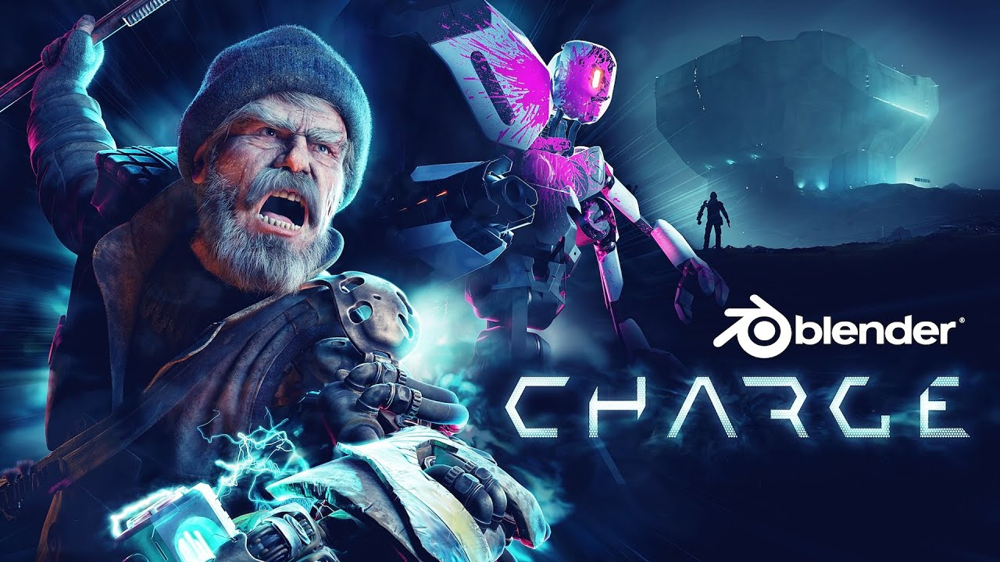
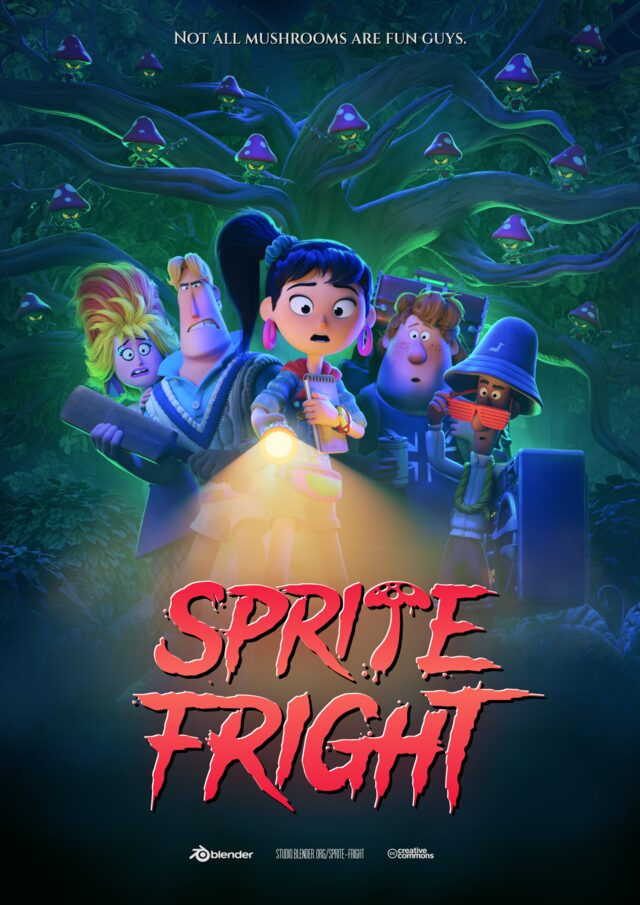
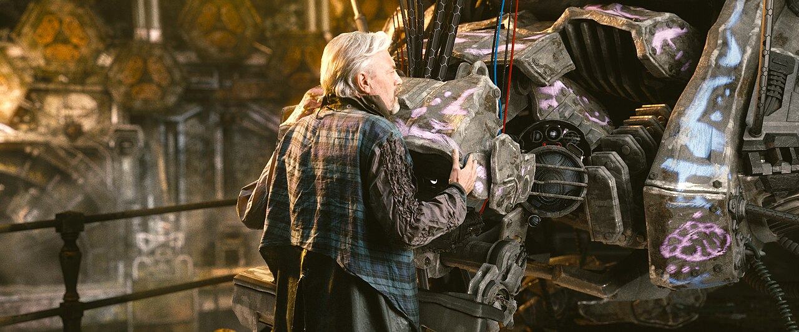

## What is Blender?

- **Blender** is free, open-source software for making **3D pictures and movies**: you build objects, color them, light the scene, aim a camera, and **render** (compute) a final image or animation.

\

- **What it does:** modeling (shape), materials (look), lighting, cameras, animation, and rendering — the same pipeline Hollywood and game studios use, in one app.

\

- **How it works:** everything lives in a 3D scene (objects + lights + camera). You edit that scene in the viewport; when you hit **F12**, a **render engine** (Eevee or Cycles) traces light through the scene and paints the pixels of your PNG.

## A taste of Blender

Four images, all made with Blender:

::: {.blender-gallery}
<figure><figcaption><em>Charge</em>, Blender Studio, CC BY 4.0</figcaption></figure>
<figure><figcaption><em>Sprite Fright</em>, Blender Studio, CC BY 4.0</figcaption></figure>
<figure><figcaption><em>Big Buck Bunny</em>, Blender Foundation, CC BY 3.0</figcaption></figure>
<figure><figcaption><em>Tears of Steel</em>, Blender Foundation, CC BY 3.0</figcaption></figure>
:::

## Where this fits

- You will use Blender twice: tomorrow to render your CAD mechanism, and next week to turn simulation numbers into a movie of the sliding brick.

\

- Today is about getting started: build a small scene and render one good-looking image.

## Today's target

- **By 4:00, your team can:** show a rendered still image (a PNG) of a scene you built: a few objects, at least one material with color, a light, and a camera you placed yourself.
    - Make it pretty; a floor plane, a second light, or a shiny material.
    
\    
    
NOTE: Include in your presentation two Blender-generated images produced by somebody else, and which you really liked. Credit the maker, as we did on the "A taste of Blender" slide.

## How to start

- Download **Blender** from blender.org. 
    - You get going with the famous default cube.
    - Blender is free

\

- **No "starter material" today.** The default scene already has a cube, a light, and a camera; make it yours.

\

- Ask an AI agent: "I'm brand new to Blender. How do I move around the 3D viewport?" or "How do I add a material and change an object's color in Blender?"

## Blender survival kit {.smaller}

- Orbit: **middle mouse drag** &nbsp;•&nbsp; zoom: **scroll** &nbsp;•&nbsp; pan: **Shift + middle mouse**
- **Shift+A** add an object &nbsp;•&nbsp; **G** grab/move &nbsp;•&nbsp; **R** rotate &nbsp;•&nbsp; **S** scale
- **Numpad 0** look through the camera &nbsp;•&nbsp; move the camera like any other object
- Materials live in the **Material Properties** tab (the sphere icon); start with Base Color
- **F12** render &nbsp;•&nbsp; then Image, Save As to keep your PNG
- Two render engines: **Eevee** is fast, **Cycles** is fancy; Eevee is plenty for today

## Your end-of-day talk

- ~10 minutes: show your render on the projector, and tell us what was hard and what clicked.
- **Start or Close with your team's quote of the day.**
- Stretch target: Generate a library of assets, e.g., a collection of rocks, or a collection of trees, or a collection of chairs, etc.
    - I might ask you to "donate" to the lab to include in our simulations
